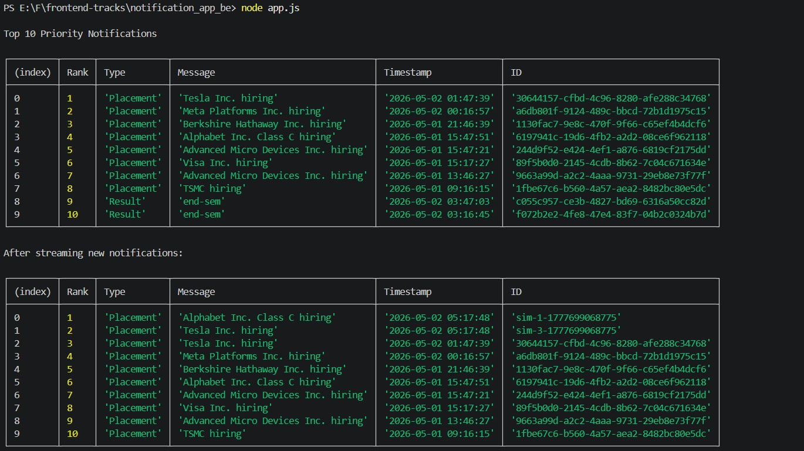
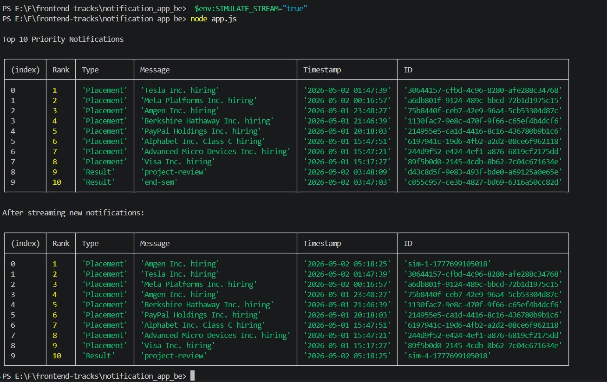
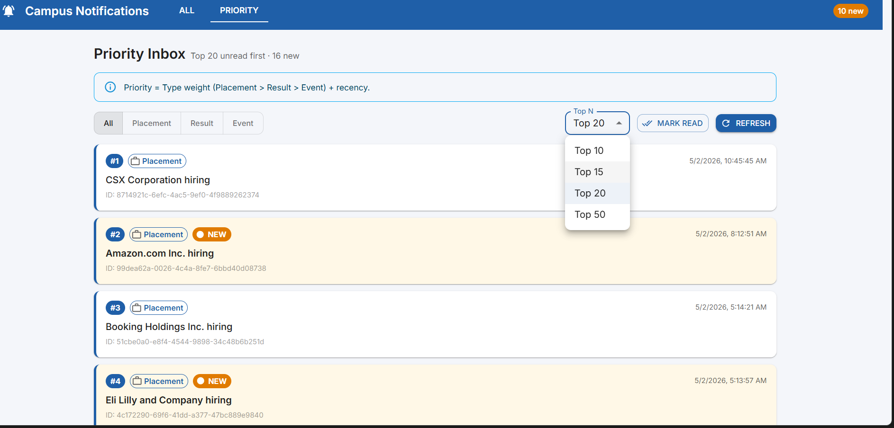
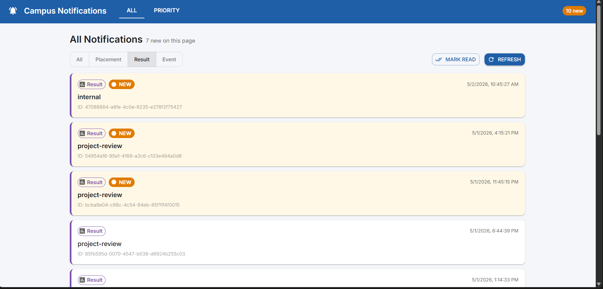
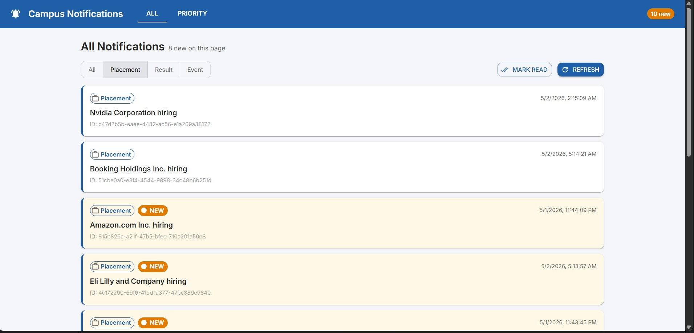

# Campus Notifications

My submission for the AffordMed evaluation. Built incrementally across stages — a reusable logging client, a Priority Inbox script, and a small React UI on top.

Repo layout:

```
logging_middleware/    # Stage 0 — reusable Log() package + Express middleware
notification_app_be/   # Stage 1 — Priority Inbox (Node)
notification_app_fe/   # Stage 2 — React + MUI frontend
notification_system_design.md   # Approach + design notes for both stages
register-and-auth.ps1  # one-time register + token fetch
refresh-token.ps1      # token refresh
```

## Setup once

```powershell
cd E:\F\frontend-tracks
.\register-and-auth.ps1     # registers + saves credentials.json + sets AUTH_TOKEN
```

Whenever the token expires:
```powershell
.\refresh-token.ps1
```

---

## Stage 0 — Logging middleware

Reusable `Log(stack, level, package, message)` that POSTs to the eval test server. Validates inputs locally against the allowed enums and truncates `message` to 48 chars (server cap). A `createLogger(stack, package)` helper avoids repeating those fields at call sites. The Express request/response middleware and error handler use the same client.

Code lives in `logging_middleware/`. See its README for usage.

---

## Stage 1 — Priority Inbox (backend)

Top-N inbox with a **bounded min-heap** of size N. Score = `typeWeight * 1e13 + epoch_ms`, weights `Placement=3 > Result=2 > Event=1`. Each incoming notification is `O(log N)` to admit or skip — memory stays at O(N) regardless of stream volume. `Set` of seen IDs handles dedupe.

Run:
```powershell
cd notification_app_be
npm install
node app.js
# stream demo:
$env:SIMULATE_STREAM="true"; node app.js
```

### Output

Initial top-10 from the live feed:



Streaming demo — same heap absorbing simulated new arrivals, recomputing the top-10 in O(log N) per insert:



---

## Stage 2 — React frontend

Vite + React 18 + Material UI, bound to **localhost:3000**. Two pages:

- **All Notifications** — type filter (All / Placement / Result / Event), pagination via `limit`+`page`.
- **Priority Inbox** — Top-N selector (10 / 15 / 20 / 50), same type filter, same scoring as Stage 1 but ranked client-side over a multi-page sample (server caps `limit` at 10).

New vs. viewed is tracked in `localStorage` — unseen cards get a `NEW` chip and amber tint, the AppBar shows a global unread count, hover/click marks viewed, and there's a bulk **Mark read**. The Vite dev server proxies `/api/*` to the eval origin and injects the bearer from `VITE_AUTH_TOKEN`, so the token never lands in the bundle and CORS is a non-issue.

Run:
```powershell
cd notification_app_fe
copy .env.example .env.local
# put the token from $env:AUTH_TOKEN into VITE_AUTH_TOKEN
npm install
npm start                 # http://localhost:3000
```

### Screens

Priority Inbox with the Top-N selector open:



All Notifications filtered by Result, NEW chips on unseen cards:



Default All view, mixed read / new state:




---

## Notes

- API base: `http://20.207.122.201/evaluation-service/{notifications,logs,auth,register}`
- Tokens go in env vars (`AUTH_TOKEN` for backend, `VITE_AUTH_TOKEN` for frontend) — never committed.
- Server constraints found the hard way and reflected in code: `message` ≤ 48 chars, `limit` ≤ 10 per page.
- All logging across both stages routes through the Stage-0 `Log()` client.
